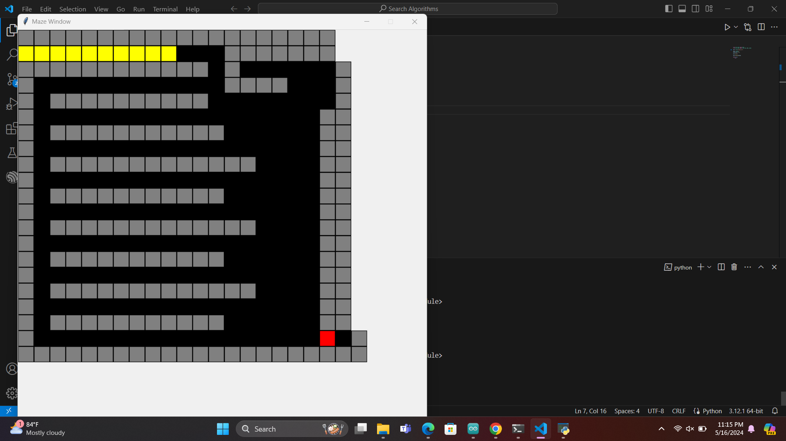
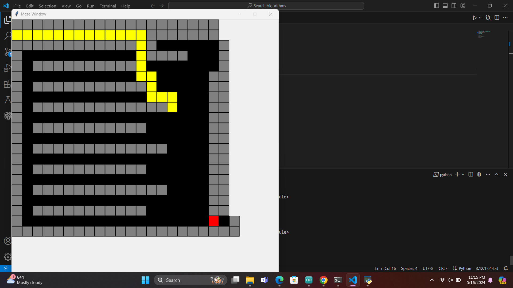
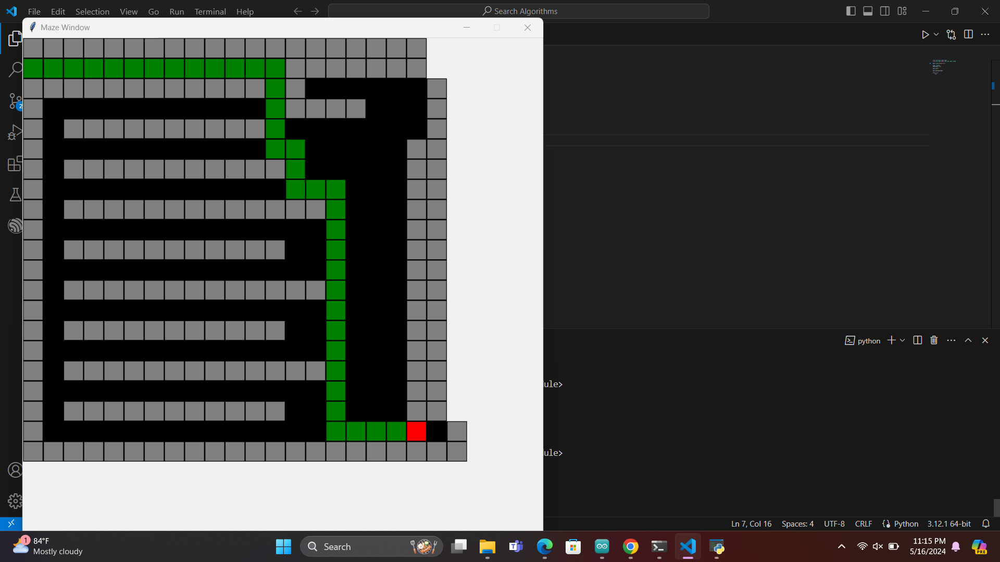
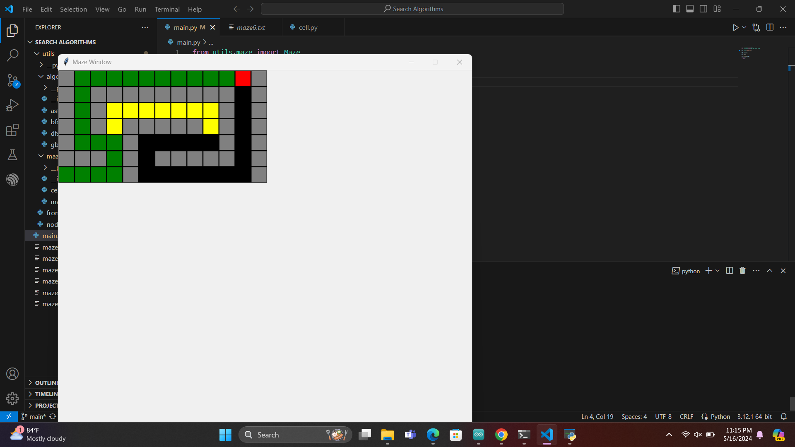

# Search Algorithm Visualization in Python

This project provides visualizations for various search algorithms implemented in Python. You can see how algorithms like Depth-First Search (DFS), Breadth-First Search (BFS), Greedy Best-First Search (GBFS), and A* work in real-time.

## Algorithms Implemented

- Depth-First Search (DFS)
- Breadth-First Search (BFS)
- Greedy Breadth-First Search (GBFS)
- A* Search Algorithm (ASTAR)

## Getting Started

1. Clone the repository:

   ```bash
   git clone https://github.com/tharushaudana/search-algorithm-visualization-python.git
   ```

3. Run the visualization script:

   ```bash
   python main.py
   ```

## Screenshots









## Contributing

Contributions are welcome! Please feel free to open a pull request.

## License

This project is licensed under the MIT License - see the [LICENSE](LICENSE) file for details.